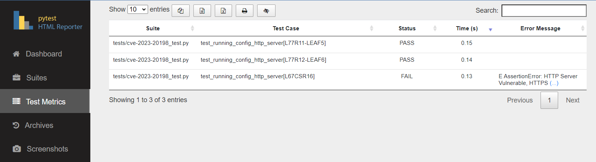

#  

This project provides examples to extend the IP Fabric platform with custom device testing.

*This project is still in development and more test cases and examples will be added at a later time.*

## Installation

The project is available on GitLab and can be installed by cloning the repository:

```bash
git clone https://gitlab.com/ip-fabric/integrations/pynetcheck.git
poetry install
cp sample.env .env
```

Finally edit the `.env` file to include your IP Fabric URL and credentials.

## Running

To run tests, use the following command:

```bash
poetry run pytest
```

To run using a configuration directory simply place all text configs in a single directory and run the following command:

```bash
poetry run pytest --dir=/path/to/dir
```

## Results

Results are stored in the [pytest_html_report.html](example/pytest_html_report.html) which can be viewed in any browser.  This also provides the ability to export via CSV or Excel formats.

